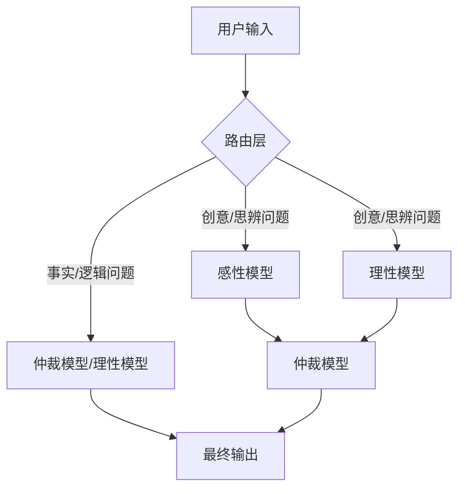

# LuKu LinAria：一种用于增强生成质量的二律背反式大语言模型架构

## 摘要
LuKu LinAria/路库利亚架构是一种新颖的大语言模型（LLM）架构方案。其核心思想是通过引入“二律背反”式的内部协商机制，将一个创意生成任务分别交由感性与理性两个专用小模型处理，再由一个大参数模型担任“仲裁员”，综合双方输出以生成更全面、更具深度的结果。本架构旨在优化LLM在创造性任务（如文学创作、哲学思辨）中的输出质量，而非追求推理速度。

## 1. 简介
当前的大语言模型在处理事实性查询时表现出色，但在需要多角度、辩证思维的开放性创意任务中，其输出往往趋于单一或平庸。LuKu LinAria 架构通过模拟二律背反观点与辩论决策过程，试图解决这一问题。

## 2. LuKu LinAria 架构

### 2.1 核心思想：二律背反式参考
架构的核心是让两个立场、风格迥异的小模型（一个偏向**感性/发散**，另一个偏向**理性/收敛**）对同一任务进行独立处理，产生两种不同的初步输出。这种“对立”创造了丰富的思考张力，为最终输出的深度和全面性奠定了基础。

### 2.2 核心组件
- **感性模型**：一个小参数模型，负责生成富有想象力、情感充沛和打破常规的初始内容。
- **理性模型**：一个小参数模型，负责生成逻辑严谨、结构清晰、符合事实与规范的初始内容。
- **仲裁模型**：一个大参数模型，接收感性模型和理性模型的输出作为参考。它负责分析、权衡、融合双方的优点，并生成最终优化的结果。
- **路由层**：一个智能判断层，可以由一个独立的模型构成，用于分析判断用户输入。它将事实查询、逻辑计算等任务直接路由至仲裁模型或理性模型，以规避不必要的内部噪声；仅将创意性、思辨性任务送入完整的二律背反流程。

### 2.3 工作流程
1.  **输入**：用户提出问题。
2.  **路由判断**：路由层分析问题类型。
    -   **若为事实/计算问题**：直接路由至`仲裁模型`或`理性模型`，快速给出准确答案。
    -   **若为创意/思辨问题**：进入完整流程。
3.  **二律背反流程**：
    -   问题被同时发送给`感性模型`和`理性模型`。
    -   两者独立生成初步结果。
    -   两者的输出作为参考信息，一同提交给`仲裁模型`。
    -   `仲裁模型`综合参考信息，结合自身强大的能力，分别输出两个结果的优化，再输出一个均衡的结果，生成最终输出。
4.  **输出**：返回最终结果。

## 3. 与现有技术的区别
- **与混合专家模型（MoE）的区别**：MoE 旨在通过激活不同“专家”来高效处理任务的不同部分，核心目标是**提升推理速度与效率**。而 LuKu LinAria 的核心目标是**提升生成质量**，其感性/理性模型是围绕同一任务进行“对抗与合作”，旨在产生更丰富的思考维度。
- **与思维链（Chain-of-Thought）的区别**：思维链是让模型展示其推理步骤，是单一模型的线性思考过程。本架构是让多个模型进行并行且异构的思考，并通过仲裁进行整合。

## 4. 潜在应用与局限性
- **应用场景**：辅助创作（文学、剧本、音乐）、哲学辩论、头脑风暴、需要多角度分析的战略咨询。
- **局限性**：由于引入了内部协商，推理成本较高，不适用于对延迟要求极低的场景。在纯粹的事实查询和逻辑推理任务上，完整的二律背反流程可能因内部噪声而表现不佳（通过路由层规避）。

## 5. 结论
LuKu LinAria 架构提出了一种新思路：通过模型间的宏观“辩证”来提升大语言模型的创造性输出质量。它强调，对于特定任务，“思考过程的丰富性”可能比“思考模型的大规模”更重要。该架构能整合更全面的视角，形成一个“专家合集”。与在巨型模型上做“减法”以降低性能消耗的思路相比，这种集成了优化与解耦的参考架构，或许能更好地在较低算力平台上平衡算力需求与输出质量，或在特定任务中取得更优效果。

---

## 架构流程图 (Mermaid)

作者：[周陈宇杰/lvds]

---

[2025/10/29]

